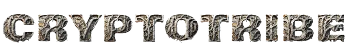

# CryptoTribe

  

  

  
  
  
  

## About

CryptoTribe is an immersive decentralized application (dApp) designed to manage and engage cryptocurrency communities through strategic gameplay. Set in the fantasy world of Ealdoria, users can build, manage, and expand their empires by leveraging blockchain technology for secure and transparent operations.

## Features

- **Decentralized Governance**: Community-driven decision-making processes ensure fair and transparent governance.
- **Secure Transactions**: Blockchain technology guarantees safe and transparent financial operations.
- **Smart Contracts**: Automate agreements without intermediaries, ensuring trust and efficiency.
- **Strategic Gameplay**: Manage resources, build defenses, and train armies to protect your realm and expand your influence.
- **Community Engagement**: Form alliances with other players, trade resources, and collaborate on common goals.
- **Unique Artifacts**: Discover and utilize ancient artifacts like the Threads of Continuity and the Gleam of Eternity to gain an edge over your rivals.

## Game Description

### Welcome to the World of Ealdoria

In the shadows of bygone ages, where kings and warlords once clashed for supremacy, a new power rises. In Ealdoria, the fate of your realm rests in your hands. You are the architect of your own empire, and only through astute management and strategic thinking will you survive and thrive in this unforgiving world.

The paths of trade and economy are the lifeblood of your realm. Wealth and resources must be managed wisely to train a formidable army. But beware, for building your defenses is equally crucial. Enemy hordes will scratch at your gates, and only through shrewd planning and strategic placement of your defenses will you protect your lands.

Ealdoria offers you the chance to forge alliances. Join forces with other rulers to pursue common goals and gain powerful bonuses. Yet be vigilant – not all who seek friendship are true allies. Intrigue and betrayal lurk around every corner.

Ancient artifacts and forgotten relics, known only as the Threads of Continuity and the Gleam of Eternity, weave through the very essence of this world. Only the knowledgeable, the brave, will understand the hidden powers and possibilities they hold. These enigmatic forces shape the fabric of power and influence in Ealdoria.

Are you ready to forge your destiny and lead your realm to immortal glory? Dive into the deep mysteries of Ealdoria and begin your journey today.

## Get Involved

Join us on our journey to revolutionize community management in the crypto space. Whether you're a developer, a community manager, or simply a blockchain enthusiast, there's a place for you in the CryptoTribe.

- **Follow**: Stay up-to-date with our latest developments by following us on [Twitter](https://twitter.com/shortaktien) and [GitHub](https://github.com/shortaktien/cryptotribe).

## License

This project is licensed under the MIT License - see the [LICENSE](LICENSE) file for details.

## Contact

For any inquiries, please contact us at [email@example.com](mailto:info@shortaktien.de).

---

Made with ❤️ by the Alexander.
